<!-- Original inspiration from my 3 year old daughter who loves Micky Mouse. A google search of first JavaScript projects
repeatedly showed 'memory game'. I was able to envision my daughter enjoying playing a memory game with Micky Mouse characters  -->

<!-- Inspiration for description of Memory Game from [Ania Kubow](https://github.com/kubowania/memory-game.git) -->
# Micky-Mouse-Memory-Game 🧠

View [live site here](https://jwalshe86.github.io/Mickey-Mouse-Memory-Game/
)

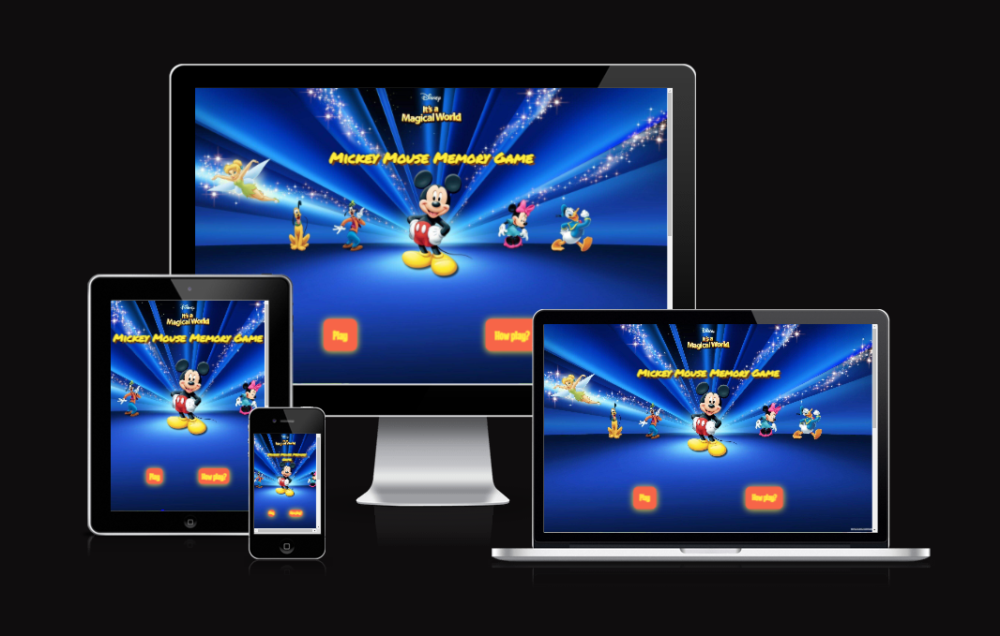

The Mickey Mouse Memory game is a simple grid based game where the player has to flip over two
cards. If both cards match, then the player receives a score of one. These cards
are then removed from the game, leaving the player with the remainder of the cards
to flip over. The game is over when all the cards have been matched and there's no 
remaining cards to flip over.

<!-- Inspiration for rules of Memory Game from [Ania Kubow](https://github.com/kubowania/memory-game.git) -->
## Rules of Memory Game 📑

### Easy Mode

- One card is flipped to start the game
- If the next card is identical, then you get +1 score
- These cards then disappear from the game
- If the next card you pick doesn't match, the cards flip back and remain in the game.
- The game continues until all the cards have been matched and have been removed.
- If you get 2 matches within 30 seconds you get 1 star 
- If you get 4 matches within 45 seconds you get 2 stars 
- If you get 6 matches within 60 seconds you get 3 stars & win the game!

### Hard Mode

- Click 'hard' on the yellow button beneath the game 
- If you can complete the game within 60 seconds
AND 30 moves you'll have one. Otherwise the game will reset and you can try again

## Contents 📖

- [Micky-Mouse-Memory-Game](#micky-mouse-memory-game)
  - [Rules of Memory Game](#rules-of-memory-game)
  - [Contents](#contents)
- [User-Stories](#user-stories)
  - [As a new visitor](#as-a-new-visitor)
  - [As a returning visitor](#as-a-returning-visitor)
- [Design UXD](#design-uxd)
  - [Strategy](#strategy)
  - [Scope](#scope)
  - [Structure](#structure)
- [Technologies Used](#technologies-used)
  - [Languages Used](#languages-used)
  - [Frameworks, Libraries \& Programs Used](#frameworks-libraries--programs-used)
  - [Skeleton](#skeleton)
- [Wireframe](#wireframe)
  - [Surface](#surface)
    - [Colour Palette](#colour-palette)
  - [Typography](#typography)
    - [Imagery](#imagery)
    - [Iconography](#iconography)
    - [Accessability](#accessability)
- [Features](#features)
  - [Cards shake when matched](#cards-shake-when-matched)
  - [Hero Image](#hero-image)
  - [Bubbles when button pressed](#bubbles-when-button-pressed)
  - [Validator Testing](#validator-testing)
- [User-Experience-Testing](#user-experience-testing)
  - [As a new visitor](#as-a-new-visitor-1)
  - [As a returning visitor](#as-a-returning-visitor-1)
  - [Bugs](#bugs)
- [Solved bugs](#solved-bugs)
- [Unfixed bugs](#unfixed-bugs)
- [Deployment](#deployment)
- [Final Product](#final-product)
  - [Laptop view](#laptop-view)
  - [Ipad view](#ipad-view)
  - [Mobile View](#mobile-view)
- [Credits](#credits)
  - [Content](#content)
  - [Media](#media)

# User-Stories

Based on my daughter and several of my friends children's interest in Mickey Mouse, I felt the Mickey Mouse theme and the 
spirit of fun was important. The visuals appeared as important to the children as the gameplay.

## As a new user
- As a child I want to have fun
- To have fun while also learning something valuable
- I want to experience the magic of Disney
- I want the game to be easy to play
- I want it to be very visual with lots of animation

## As a returning visitor

- I want to be able to measure my progress and try to beat my previous score
- I'd like to see if I'm getting better at the game
- I want to see if I can get 3 stars
- - As my skills develop I would like to challenge myself more by playing at a more challenging level.

# Design UXD

## Strategy

Playing memory games may help with a child's cognitive development. Having fun is a positive incentive for children to learn. Mickey Mouse has a long history of entertainment when it comes to children. The aim was to use fun and the magic of disney to motivate children to play a memory game. 

## Scope

The scope covered the needs of 3+ year old children and their need for fun and memory development. The site is simple in it's layout - so it can be easily used by children. Customers can easily navigate the page and a pop up provides information on how to play the game. The main constraint was that only CSS, HTML and Javascript languages were used. 

## Structure 

### Landing Page

- Hero Image with disney characters
- Left button which brings viewer to the game
- Right button which creates a pop up which explains how to play the game to the viewer

###

- I felt a header wasn't required and would have added to the complexity of the landing page which I hoped to avoid. 

### Game Page

- Title prompt to explain to viewer all they need to do is click a card to start the game
- Information about how the viewer is doing regarding the game is held in a 'flag' above the game. This information covers the time, moves taken, stars gained and a reset icon.

### Congrats Popup

When the player completes the game a congrats pop up is shown with the viewers scores.

# Technologies Used 🧑‍💻

- [Git](https://git-scm.com/) was used for version control via GitPod by using the terminal to Git and Push to GitHub
- [GitHub](https://github.com/) was used to store the project code after being created in GitPod / Git
- [Gitpod](https://www.gitpod.io/) was used to create, edit & preview the project's code
- [Node](https://nodejs.org/en) was used to support Jshint
- [Jshint](https://jshint.com/) used to find coding errors
- Images compressed on [TinyPNG](https://tinypng.com/)
- Background image color changed using [remove.bg](https://www.remove.bg/t/change-background)
- Icon on back of cards change using [lunapic](https://www9.lunapic.com/editor/)
- Stars & reset icon from [cdnjs.com](https://cdnjs.com/libraries/animate.css)
- Icons from [Iconify](https://iconify.design/)
- Javascript validator [beautifytools](https://beautifytools.com/javascript-validator.php)
- Responsiveness check [Am-I-Responsive?](https://ui.dev/amiresponsive?)
- Lighthouse check on google chrome
- Hero Title from Google Fonts
- [Code Beautify](https://codebeautify.org/) was used to clean up the code alignment 
- Balsamiq Wireframes
- A colour palette was created using [color-adobe](https://color.adobe.com/create/color-wheel)
- Gifs created using [EZGIF.COM](https://ezgif.com/)
- [ytmp3](https://ytmp3.nu/dijp/) to convert youtube to mp3
- [veed.io](https://www.veed.io/) to cut mp3 clips to ideal size
- [webfx.com](https://www.webfx.com/tools/emoji-cheat-sheet/) for emoji's
- Images converted to webp using [Convertio](https://convertio.co/download/df1aa8ccf17ac45e8cec9876eb39385e9ea205/)

## Languages Used

Javascript, CSS & HTML.

## Skeleton ☠

The premise was very simple a landing page and then the game page. The aim was to keep it simple as the target audience was young children. The use of a modal helped keep the layout clear. Wireframes were created with the an initial blueprint of the project for desktop, ipad and mobile.

Wireframe Desktop View

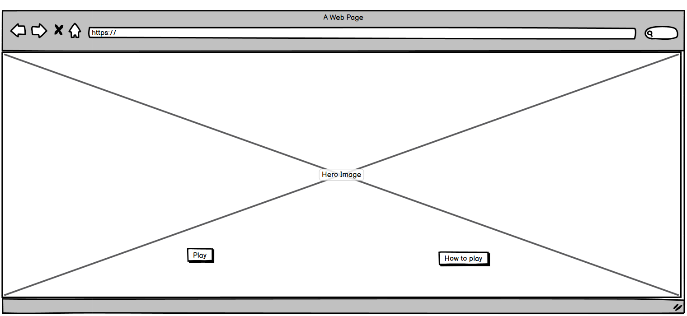
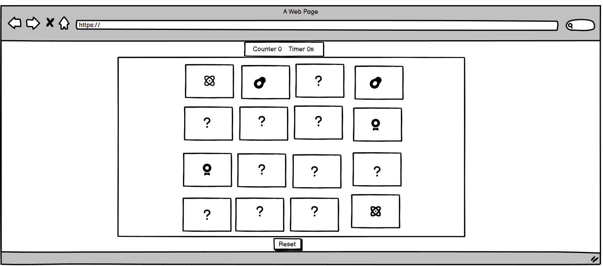

Wireframe Ipad View

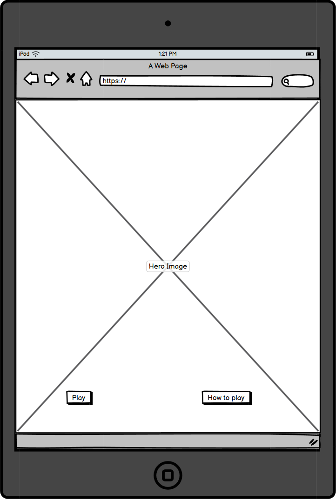
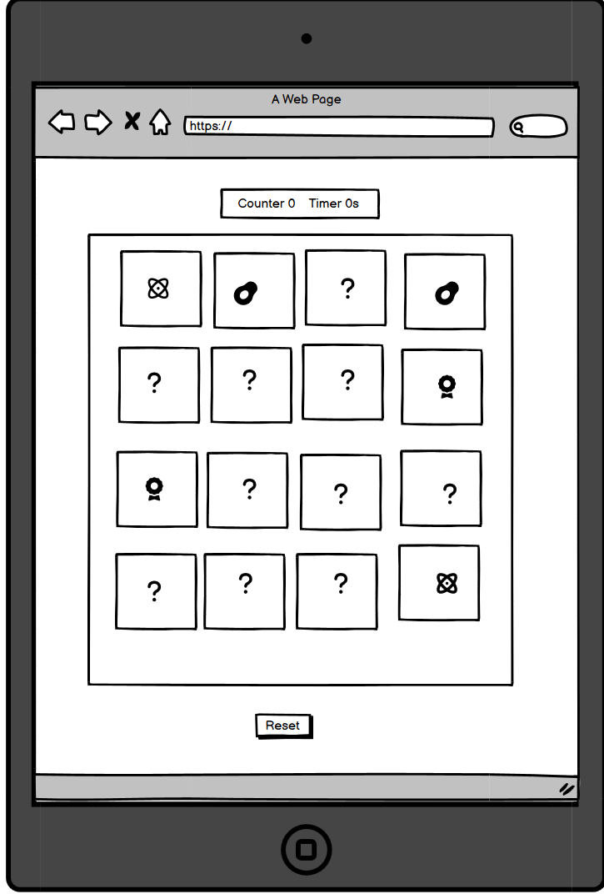

Wireframe Iphone View

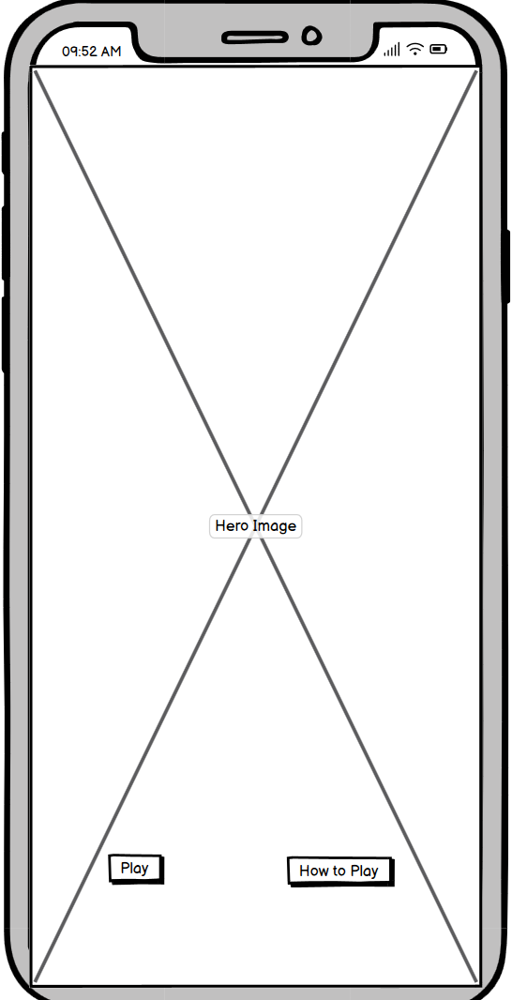
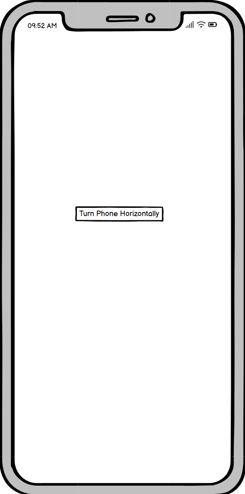
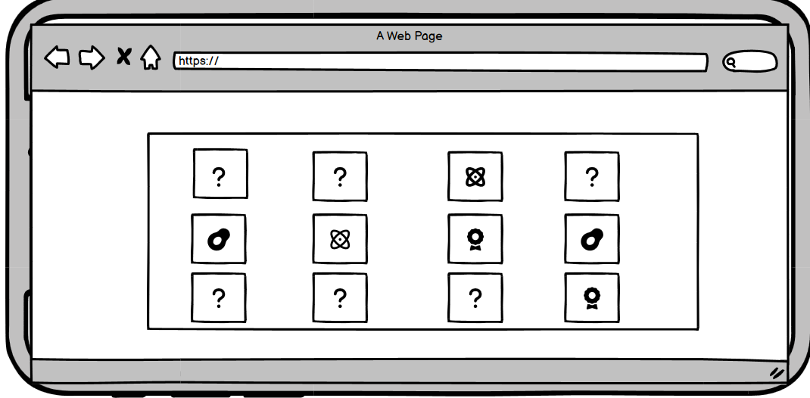

## Surface

### Colour Palette 🌈

The hero image was chosen due to it containing many of the colorful Mickey Mouse characters which would be used in the game. The blue with the stars in the background is visually appealing. The background image of the game background was changed to match the hero image background color. Google Dev tools was used to find the background Hex number and applied to the background of the background image on the game page.

A colour palette was created using [color-adobe](https://color.adobe.com/create/color-wheel)

Used Color Palette

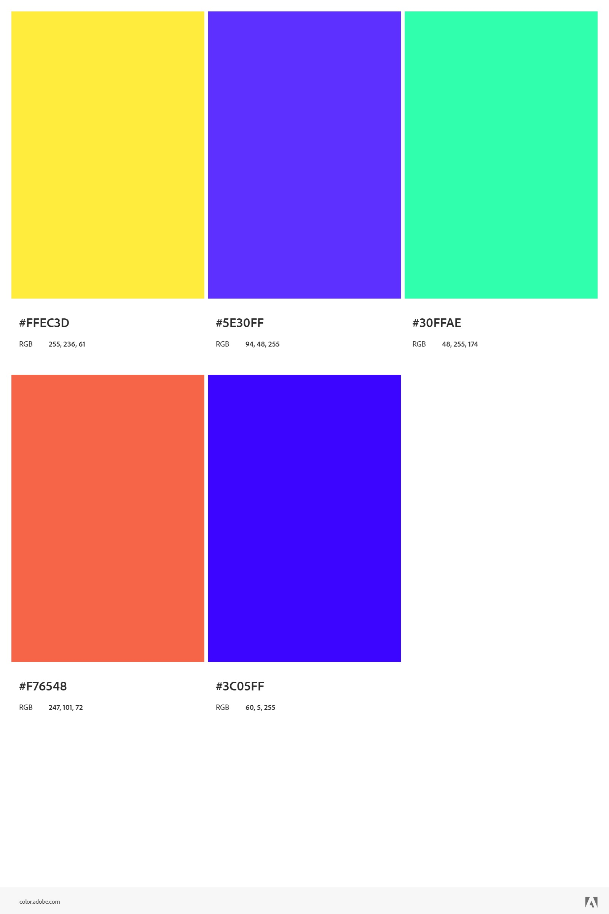

## Typography

The Mouse Memoirs font was chosen as the name fit with the theme and the comic style font suited the fun theme of the game. 

### Imagery 📷

- Mickey Mouse character images taken from [PNGWing](https://www.pngwing.com/).
- Images compressed on [TinyPNG](https://tinypng.com/).
- Disney logo sourced from [Disney UK](https://static-mh.content.disney.io/matterhorn/assets/logos/disney_logo_dark-baa807690db7.png);
- Background to images removed using [remove website](<https://www.remove.bg/>)
- Hero image was taken from [wallpapercave.com](https://wallpapercave.com/free-disney-backgrounds#google_vignette)

### Iconography

The Mickey Mouse favicon in the browser text was taken from [icons8](https://icons8.com/icons/set/mickey-mouse)

### Sounds 🔊

- Mickey Mouse, Goofy and Daisy Duck sound clips courtesy of [Mallerie's Sonic Boom The Series](https://www.youtube.com/watch?v=NYttHXAszkk),(https://www.youtube.com/watch?v=elmbWaAKM1E)
- Donald Duck sound clip courtesty of [Minnie-Mouse](https://www.youtube.com/watch?v=xB2S7qmebUk)
- Pete sound clip courtesty of [Dave-Lee-Down-Under](https://www.youtube.com/watch?v=7MXj2F6zLqk)
- Sparkle sound effect from [orangefreesounds](https://orangefreesounds.com/sparkle-sound-effect/#google_vignette)
- Mickey Mouse congratulations and ding sound sound effects from [101soundboards.com](https://www.101soundboards.com/sounds/1342530-gosh-what-a-great-place-congratulations-pal)

### Accessability ♿

The WAVE accessabilty tool found [6-contrast-errors](./assets/images/readme-images/WAVE-results.png). However, the test here appears to be picking up previous versions of the game. A check of contrast using google dev tools found the contrasts were fine. There was one contrast issue with the green 'ok' button on the congrats modal. Chaning the background of the button here to black and the text to white addressed this. All the 'cards' have an alt text attribute. 4

# Features

## Hero Image 🦸‍♀️

The Disney themed hero image was used to capture the fun and excitement of Disney. The aim was to get the viewer to further explore the page and play the game. 
  
  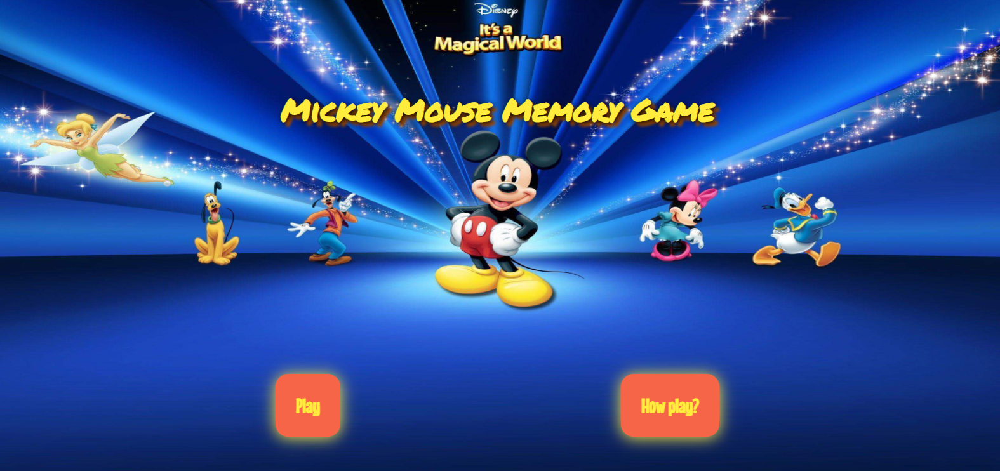

## Orientation Change Prompt

For smaller screensizes the user is prompted to turn the device from portrait to landscape

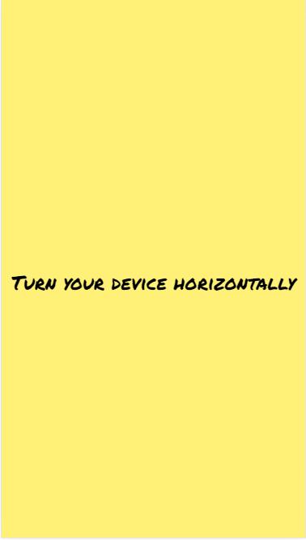

## Sound On/Off button

Pressing the volume icon toggles between having sound or not. This adds to the users sense of control and improves their experience.

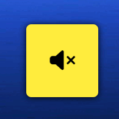

## How play modal

Upon pressing the 'How Play' button a modal pops up which tells the player how to play the game. A yellow overlay is also used to focus the users attention to the pop up.

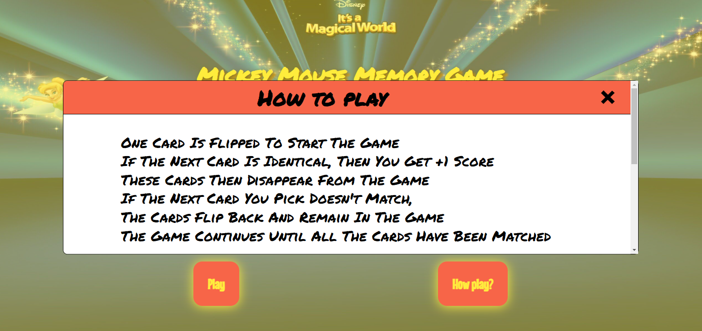

## Buttons Hover

The buttons change color from yellow to orange when hovered over. This adds to the sense of interactivity with the page & shows the user they are in the correct place to click. 

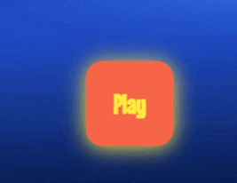

## Cards shake when matched

 Code from this feature was adapted from [unused-css.com](https://unused-css.com/blog/css-shake-animation/). This is to add to the sense of fun while playing the game. This was deemed particulary important as the game was targeted at young children.
 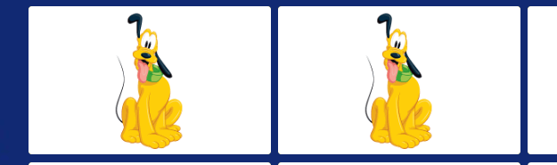

 ## Specific character sounds when matched

 When a specific characters cards match a sound specific to that character is produced. 

## Stars when button pressed ⭐

- This again added to the element of fun, while playing. The code was adapted from [GreatStack](https://youtu.be/Odr24UQs3uY?feature=shared). Stars pop out of both the play and play how buttons when pressed. 
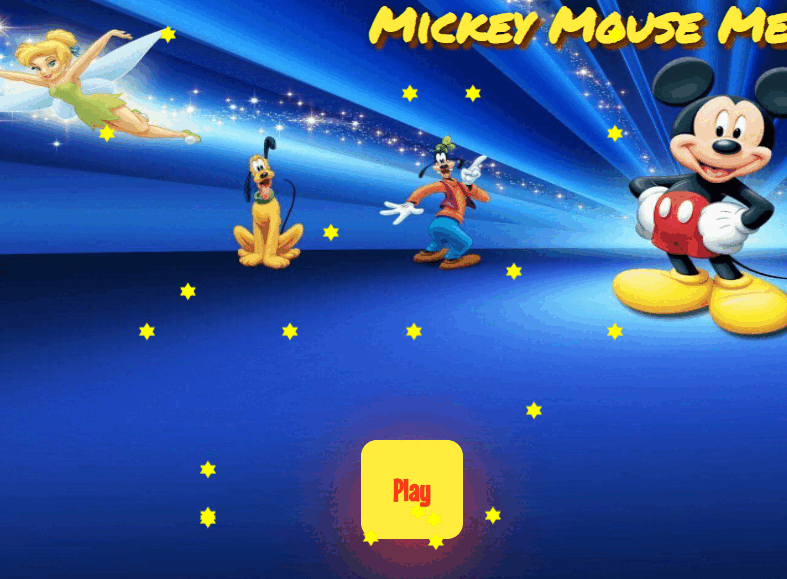

When the stars pop a glistening sound activates.

## Text Bounce

The click card title 'bounces' up and down to prompt the users attention. 

Once the first card is clicked this text no longer bounces and is removed from the screen.

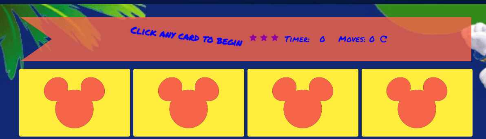

## Game Feedback

### Stars Scoring

- If a user gets two matches before 30s it gets one star, if it gets 6 matches before 45s it gets 2 stars & 3 stars before 60s gets 3 stars which is the top score. The stars on the screen are dimmed but if a user gains a star, a dimmed star lights up. 

When a star is scored a ping noise activates

### Timer ⏲

- The time starts at the beginning of the game and players can aim to get more stars in less time.

### Moves ♟

The moves counter increases whenever a player tries another card. Getting 3 stars with the least amount of moves is another sign of progress. 

### Reset 👈

The reset game button is displayed as a repeat icon. This looks pleasant and is easily accessible.

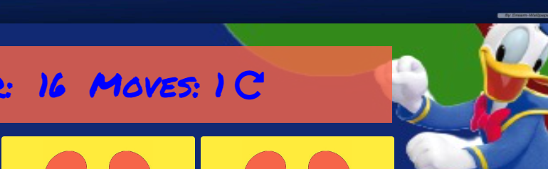

## Game level toggle

A toggle button is display under the cards so the user can choose between easy and hard. This also adds to the users ability to interact with the game.

On 'Easy' the timer just continues to increment with no deadline. The moves also increment. If a player gets a certain number of matches within a certain time/moves they receive a star. 

On 'hard' the timer default start setting changes to 60 seconds, and the moves counter now starts at 30 moves. 

The user now has to complete the game within 60 seconds or 30 moves. 

### Footer

The footer contains an email address for the user to contact. There are also 3 social media links: Disney Website, Mickey Mouse Facebook and Mickey Mouse Instagram

### Congrats Modal 😁

When the game is completed a modal pops up congratulating the user. It also tells the user it's socre re stars, time and moves. A blue overlay is also present to focus the users attention on the pop up.

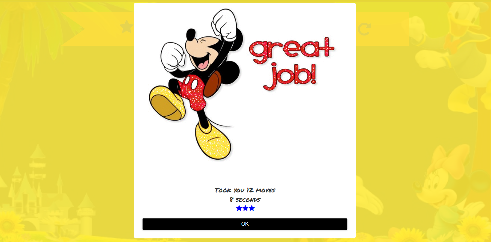

### Error Page 😵

Error page displayed when wrong address is entered. It offers a link to the games main page

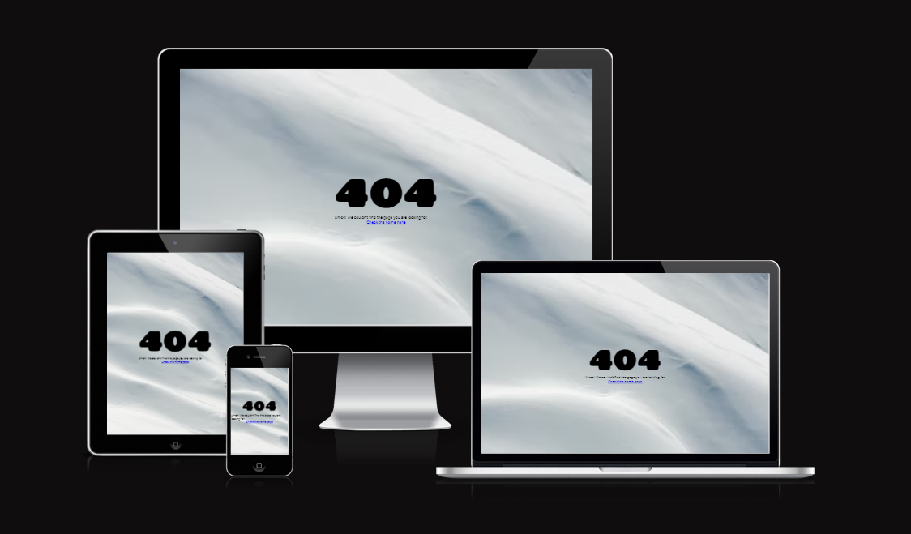

# Testing

## Manual Testing

[Code-Institute-Manual-Testing-Overview](./CI-Manual-testing-overview.pdf) was used as a guide for the following.

### Responsiveness Testing

Responsiveness Test Checksheet

A big challenge was that dev tools on all browsers didn't match my actual iphone 7 screen size. This meant I eventually had to find the exact viewport size for my phone through trial and error (as the numbers given were incorrect). Instead of using a media query with max height and width, I had to set a specific size for the iphone 7 so it didn't interfere with the other screensizes. There was also bugs between going from easy to hard mode and vice versa. I had to refactor alot of functions and make them more specific and ensure they acted appropriately depending on the game mode. 

Galaxy 5S orientation error

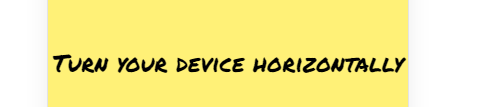

Galaxy 5s hero title too low

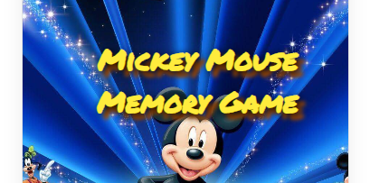

Ipad clickcard jump screen

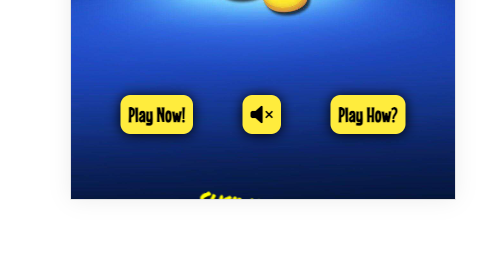

Ipad congrats modal too high

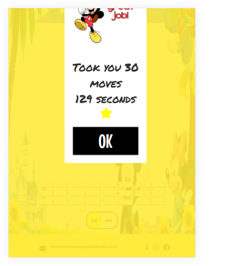

Ipad easy/hard overspill

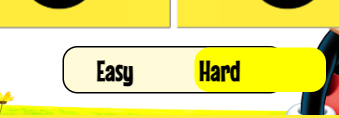

Ipad footer email too small

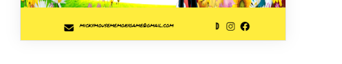

Ipad game info padding too small

Ipad game mode button too small

Ipad Pro click card font too large

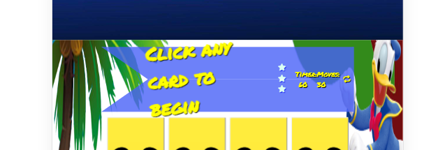

Ipad yellow back card showing upon card match

Cards disappear when change mode

### Browser Compatibility

Browser Compatibility

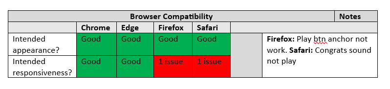

On Firebox the play button anchor went to an error page. On safari mobile the play congrats audio would not play. All other browsers tested were fine. 

Firefox Browser Hero Image

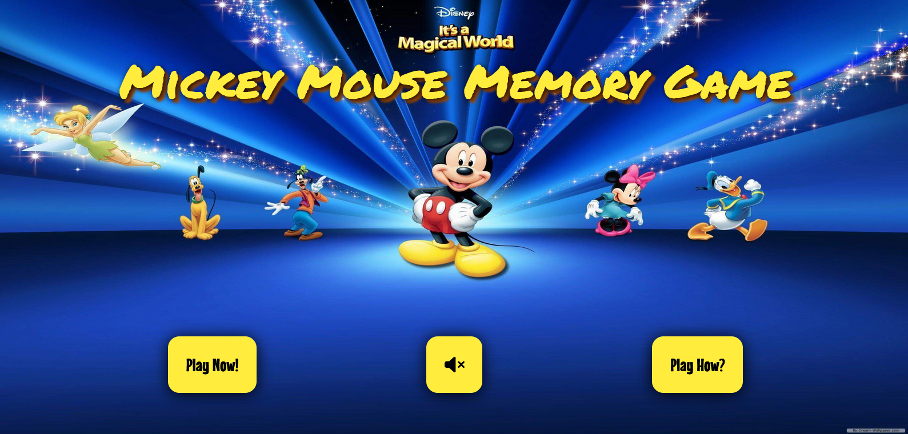

Firefox Browser Game Image

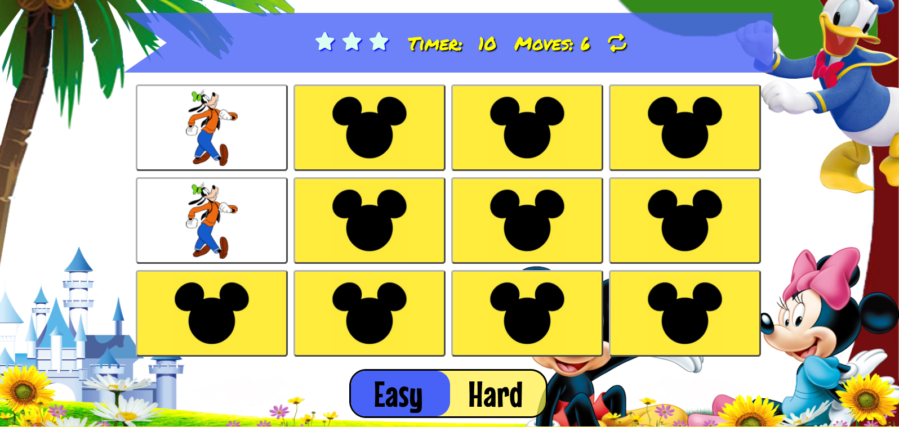

Firefox Browser Error Image

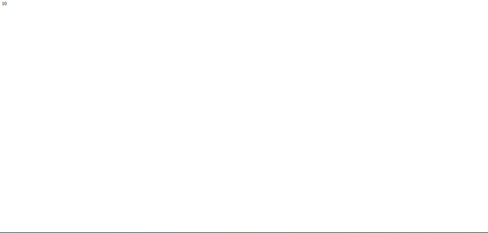

Chrome Browser Hero Image

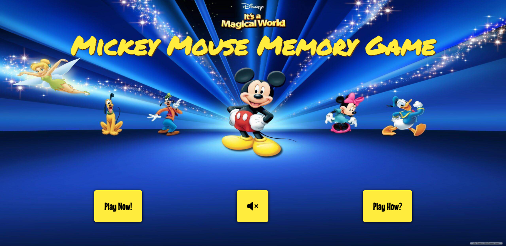

Chrome Browser Game Image

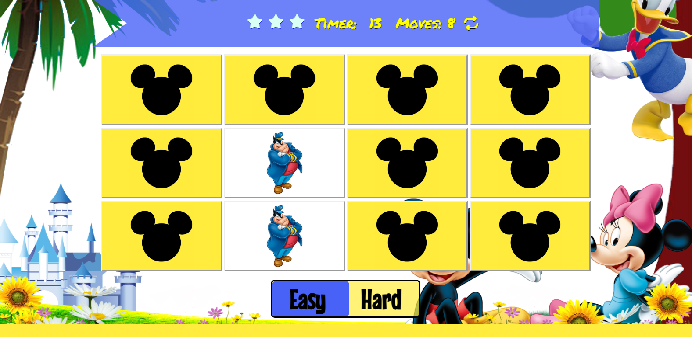

Edge Browser Hero Image

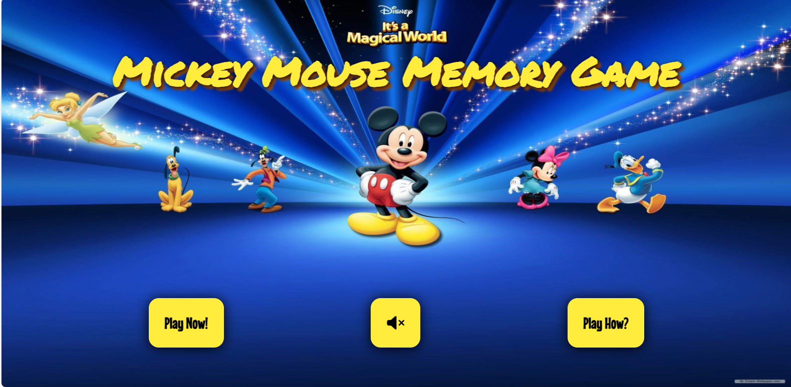

Edge Browser Game Image

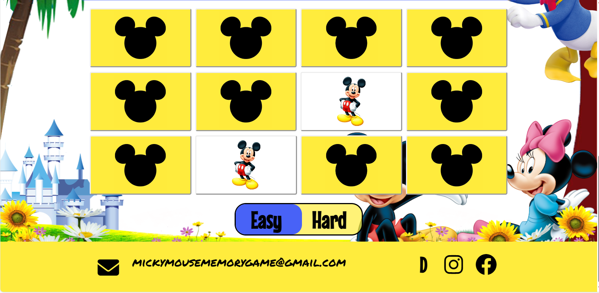

### Change in color of play/how play buttons when hovered over by cursor

- Expected: Play/How play buttons background to change from orange to yellow; and text to change from yellow to orange
when hovered over by the cursor.
- Test: Hovered over both buttons once.
- Result: As expected, both buttons background changed from orange to yellow and the text changed from yellow to orange when the cursor hovered over them.

### Stars Pop from play/how play Button

- Expected: Play/How play buttons ared expected to release yellow stars in an upwards fashion when pressed. 
- Test: Tested the play/how play buttons by pressing on them once.
- Result: The play/how play buttons responded as expected and yellow stars rose up left and right of both buttons.

### How play Modal 

- Expected: A text box to pop up explaining how to play the game. This modal should also close by pressing the x in the top right or pressing anywhere outside the modal. A transparent yellow overlay is also expected to pop up. Both should leave when the modal is closed.
- Test: Press how play button once. Press x to exit. Then press how play button again and press outside modal to exit.
- Result. As expected the modal popped up when pressed. Unexpectedly, the padding between the top of the text and the modal title appears too wide. Also the title and x button appear to small. As expected pressing the x button closes the modal. As expected pressing anywhere on the overlay closes the modal too. 
 Fix: By reducing the line height to 1.3 the gap between the title and text was reduced. The text was also aligned to the center by using padding left and right. Both heading and title rem was increased to 4rem. The modal text also had to be re-sized at different screen sizes. A final check found text in the how play is responsive at all screen sizes.

 ### Play button anchor

 - Expected: Clicking on the play button to bring user to game page.
 - Test: Click on play button.
 - Result: As expected, user is brought to the game page

 ### Click Card to begin text

 - Expected: Click card text to bounce when user is directed to game page from play button. Click card text to disappear when user has clicked any card. Timer and mover text to then increase in size.
 - Test: click start button & then click any card
 - Result: As expected click any card to play text 'bounces' when user lands on game page. As expected when the user clicks a card this text disappears and the Timer And Moves font size increases. Unexpectedly, the Timer & Mover font size isn't responsive and overflows it's background as the screensize reduces. 
 Fix: Changing the font size type from rem to vw made the text responsive.

 ### Timer
 - Expected: Timer to start when first card clicked & reset to zero when game over. 
 - Test: Click first card & 'ok' button on congrats pop up to end game.
 - Result: As expected the timer activated when the first card was clicked and then reset to zero upon a new game.

 ### Moves

 - Expected: Move counter to increase with each new move. Move counter not to increase when same card pressed twice.
 - Test: Click 5 card. Click 5th card twice.
 - Result: As expected the moves went up on each card click. When the 5th card was clicked twice the moves counter remained the same. 

 ### Reset icon

 - Expected: Clicking on the icon resets the cards, timer, moves and stars to default.
 - Test: Activate game. Get one star. Then press reset icon. 
 - Result: As expected all items returned to their default values.

 ### Stars Scoring

 - Expected: If you get 2 matches within 30 seconds and under 20 moves you get 1 star 
             If you get 4 matches within 45 seconds and under 25 moves you get 2 stars
             If you get 6 matches within 60 seconds and under 30 moves you get 3 stars 
             A pop up will then show up showing the no. of stars you got
- Tests:
         - Play game and check if 2 matches under 30 seconds and 20 moves pops up a star. 
         - Play game and check if 4 matches under 45 seconds and 25 moves 2 stars show.
         - Play game and check if 6 matches under 60 seconds and 30 moves 3 stars show.
- Result: 
        - As expected one star displayed when 2 matches were made under 30s and within 20 moves. 
        - As expected when 4 matches were made under 45s and within 25 moves a second star popped up. 
        - As expected when 6 matches were made under 60s and within 30 moves a third star popped up. Unexpectedly 4 stars displayed on the congrats modal instead of three.
- Fix: 
        - Stars are continually being added to the star counter after the first match. Once one star has been added the function here needs to stop. A variable named increaseStar1 was set to true. If 2 cards match AND this is true then a star is added to the counter. When this happens the increaseStar1 is set to false, so no more stars are added. Using the same logic when 4 card matches addresses this issue there. Using this logic on all matches creates the correct result in the counter.

### Card 'shake' when matched

- Expected: Cards to shake briefly when matched. Cards then to stop shaking and remain front facing.
- Test: Play game until a match is made. 
- Result: As expected the cards shake briefly when matched. They then remain flipped. However, the yellow back card is 
  taking away from the front card shake. It would be better if this was removed completely when cards matched, so it isn't visible in the background. 
- Fix: Using javascript a visibility hidden style is added to the back card when there's a match; so it no longer interferes when the front card is shaking. 

### Congrats Modal appears 

- Expected: A congrats modal to appear when all cards are flipped. This should have an image of Mickey saying congrats. It should also display the users moves, time and star scores. Modal to disappear when ok button clicked. Modal to also disappear and game reset when overlay is clicked anywhere.
- Test: Play game to completion.
- Result: Modal displaying correctly with correct scoring for moves, seconds and stars. When the ok button is clicked the game resets as expected. Modal closes and game resets when overlay is clicked.

### Orientate small screen prompt

- Expected: When the play button is pressed for devices with a screen width less than 667px the viewer will be met with a 
prompt to orientate their device horizontally. When they orientate the device it will bring the user to the game.
- Test: Press the play button on a iphone 5 and orientate the device when prompted.
- Result: As expected, upon pressing the play button in portrait mode, a prompt saying to turn the device horizontally is presented. Upon turning the phone horizontally the game presents. Unexpectedly, although pressing the play button brings the user to the text prompt, some of the hero image is still displaying at the top and this may take away from the users experience. 
- Fix: Create a div element and put it at the bottom of the screen. Asigning the play button anchor tag to here removes this issue. The element is then given visibility none. 

### 404 Error Page

- Expected: With incorrect website address entry a page not found page to present. It should say 404 and the link here should redirect the viewer back to the game main page.
- Test: Enter incorrect address and press on link.
- Result: As expected, the error page popped up and when the link was clicked it redirected the viewer back to the game main page. 
          
## Validator Testing

### Javascript

Script tested using [beautifytools](https://beautifytools.com/javascript-validator.php) validator. [Result1](./assets/images/readme-images/js-errors1.png), [results2](./assets/images/readme-images/js-errors2.png,) [results3](./assets/images/readme-images/js-errors3.png). Several missed semi-colons and some functions and variables that were no longer in use but had not been deleted. After addressing the errors found [two-remained](./assets/images/readme-images/remaining-errors.png), The first one related to a destructuring assingment which was viewed as an expression. However this appears to work well with the code. The other one was modal not being defined. However, modal was being used as a keyword here not a variable, and in the context a definition wasn't required. 

Script tested using jshint jscript command

18 errors were found: [jshintErrors](./jshint%20%20js%20review%20220923.pdf). All errors were subsequently addressed. Changing many of the functions to function expressions instead of function declarations helped address issues with declared functions being hoisted incorrectly. 

### HTML

[HTML-W3C-Validator-Results](./HTML-W3C-Initial-Validator-Results.pdf) found 31 errors. The majority of the errors were having a /> where the / wasn't necessary. There were also two stray div's. Once these errors were addressed, a re-run of the validator found no errors. 

### CSS

W3C CSS Validator Results

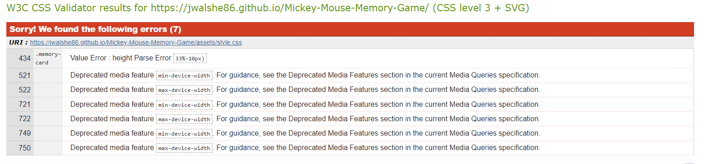

### Page Performance

[Original-lighthouse-scores-for-load-page](./assets/images/readme-images/Original-lighthouse-loadpage.png). Two SEO issues 1. Document does not have a meta description. 2. Document doesn't use legible font sizes 20.5% legible text. [Lighthouse-scores-post-edits](./assets/images/readme-images/lighthouse-score-post-edits.png) were all nearly 100% once the font size in places was increased and the meta tag given more detail.

A second lighthouse test 2 weeks later on 30/09/23 found rendering issues due to unused code. A check on google dev tools found the font awesome link was causing a big delay. I then had to remove the font awesome library link and store the icons locally using svg. This significanlty improved the lighthouse performance score. I also had to store google fonts locally as this library was also slowing the page load [How-to-add fonts-in-HTML/CSS-offline](https://www.youtube.com/watch?v=Yn55sH3FKKk)

Dev tools coverage

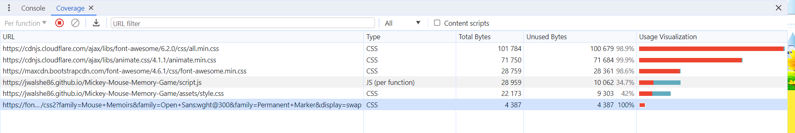

--------------

# User-Experience-Testing

## As a new visitor

- As a child I want to have fun. Achieved. My 3 year old daughter and 4 year old niece eagerly played the game and said it was very enjoyable. 

- To have fun while also learning something valuable. Achieved. Both children were able to show that they remembered where previous characters were and were subsequently able to complete the game. 

- I want to experience the magic of Disney. Achieved. Both children were able to name all the Disney characters and understood the concept presented.

## As a returning visitor

- I want to be able to measure my progress and try to beat my previous score. I'd like to see if I'm getting better at the game. Achieved. Viewers were eager to play the game again to beat their previous score and get 3 stars.
- As my skills develop I would like to challenge myself more by playing at a more challenging level. Achieved.

## Bugs

# Solved bugs 🐛

- One was able to select the div surrounding the span elements for the bubble but it would not store
in the variable 'howPlay'. When howPlay was logged it kept reading 'null'. When one tried the JS in
the html it worked. One researched this issue in [stackoverflow: Javascript only working when inside the html document](https://stackoverflow.com/questions/44160340/javascript-only-working-when-inside-the-html-document). On the final line of answers heres
someone mentioned ensuring both js files and html files were in the same document. When one did this the issue was resolved.
- The queryselector for the overlay was also selecting the classes for the bubble pop ups. This meant they bubbles wouldn't pop. It took some time to realise to specify the queryselector for the overlay, so it wouldn't interfere with the bubbles popping up. 
- The anchor tag for the play button would not wait until the bubble animation had finished. To delay the anchor link activating I found a solution on stackoverflow. This involved wrapping a setTimeout() around the {window.location = '#click-card'}
- After the 'tada' animation was introduced for when cards matched, the cards wouldn't stay unflipped. The solution involved creating an array to store the unflipped cards. Then targeting the elements in this array and adding a 'front1' class. Once this class was added the cards remained unflipped. Inspiration for this solution came from Susan Chen. However, how she designed her memory game was very different so I had to figure out a way to adapt her concept to my project.
- 3 font icon stars would not align in a row on the congrats display. The issue was you can't have the same names for a class in the one class element. To get around this one had to create a new class. However for the 3 stars the 3rd star only popped up when the card was clicked. So I had to add a card click, after the new class was created.
- Feedback from a colleague on slack Kera Cudmore highlighted how if one pressed the same card twice the counter increased. I was able to fix this by putting an if statement on the counter - ie the counter only increased if the same card was not pressed twice. 
- My custom error page didn't appear to show on the website despite following all the github instructions. I contacted Code Institute Tutor support and was informed that I was testing the error page incorrectly. To test the error page you put in an incorrect page name after the full website address - I was putting in an incorrect page name to early in the website domain name and was subsequently getting the github default error page.
- During a Slack meeting I realised we couldn't use 3rd party libraries for this project. I then had to create the card shake animation from scratch using css, html and javascript. 
Fix: Cards don't shake indefinitely
- By changing the animation ireration count to 5 directly on the 
animation css for the horizontal shake, even if the next is quickly
pressed the card won't shake after 5 iterations. .card-front.horizontal-shake {
  animation: horizontal-shaking .35s 0s 5;
}
- [Easy-To-Hard-In-Game-Error](./assets/images/readme-images2/EasyToHardError.png) 
- Solution for back of cards disappearing adapted  from code from [Web-Dev_Simplified](https://www.youtube.com/watch?v=v7rSSy8CaYE)
## Unsolved bugs 

- congrats voice not showing up on iphone 7 Safari

- Galaxy S5 Hero Title not go down

## Cleaning 🛁

- According to [ryanmcdermott](https://github.com/ryanmcdermott/clean-code-javascript) by far the most important rule in software engineering is that functions do only one thing; as it makes them easier to test, work with, reason about & makes code much cleaner. As of 240923 the code in this project had large amounts of code with several actions attributed to them. I then set myself the taks of giving every function one task. It was also important the name of the function directly reflected this one task.

# Deployment

The site was deployed on github pages from the outset. [Live site here](https://jwalshe86.github.io/Mickey-Mouse-Memory-Game/)

1. One clicked on settings within the Mickey Mouse Memory Game github repository.
2. One pressed settings and went into the pages section. 
3. Under 'Build & Deployment' the source was branch. 
4. The branch was main and folder root. 

### Cloning the GitHub Repository

You can clone the repository to use locally by following these steps:
1. Navigate to the GitHub Repository you want to clone
2. Click on the code drop down button
3. Click on HTTPS
4. Copy the repository link to the clipboard
5. Open your IDE of choice (git must be installed for the next steps)
6. Type git clone copied-git-url into the IDE terminal

The project will now be cloned locally for you to use.

# Final Product 

## Laptop view

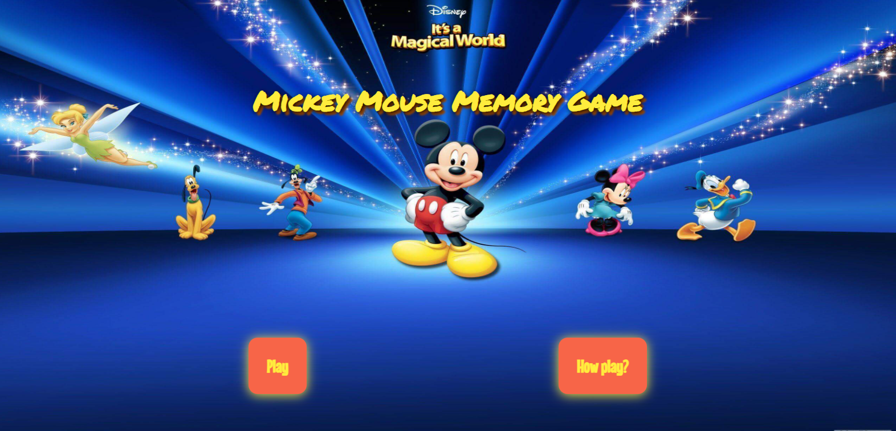
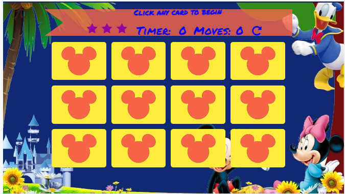

## Ipad view

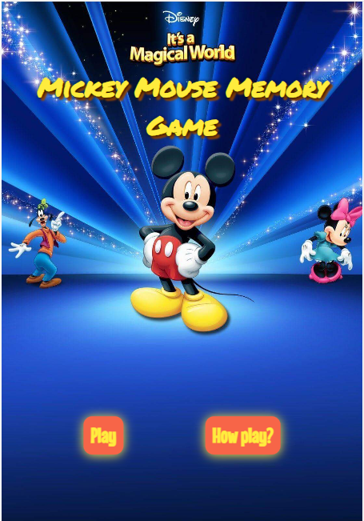
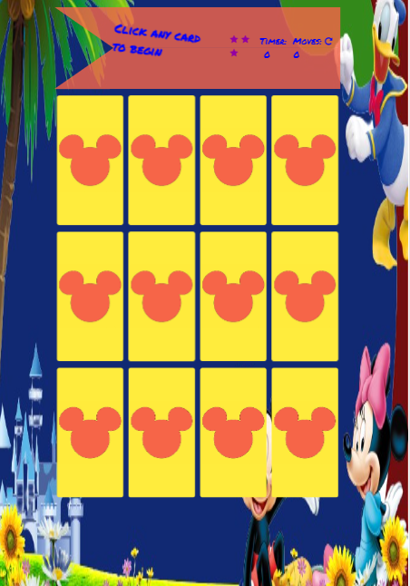

## Mobile View

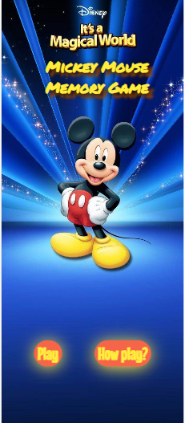

# Credits 💛

- Inspiration for description of Memory Game from [Ania Kubow](https://github.com/kubowania/memory-game.git)
- Code for memory card game adapted from [Marina-Ferria](https://www.youtube.com/watch?v=ZniVgo8U7ek);
- Code for footer, timer and counter adapted from [Moira Hartigan](https://github.com/moirahartigan/Portfolio-2---Alien-Memory-Game.git) & [Iris Smok](https://github.com/Iris-Smok/Kids-Memory-Game_PP2/blob/main/index.html)
- Getting the startTimer function to onlyrun once was taken from [Ankit Saxena](https://www.google.com/search?sca_esv=559732191&q=how+get+function+to+only+run+once+js&tbm=vid&source=lnms&sa=X&ved=2ahUKEwi0kKHpzfWAAxUlQEEAHVuqBH4Q0pQJegQIChAB&biw=1024&bih=493&dpr=1.88#fpstate=ive&vld=cid:29cb1a4c,vid:qZfK7Z75yUk)
 - Code adapted from [Cathy Dutton](https://codepen.io/cathydutton/pen/avYKeM) for timer presentation
- Code for how to play pop up modal adapted from [WebDevSimplified](https://youtu.be/MBaw_6cPmAw?feature=shared)
- Idea for score [itsourcecode](https://itsourcecode.com/free-projects/jsprojects/memory-game-in-javascript-with-source-code/?expand_article=1)
- idea for lives & dynamic card movement effect from [developedbyed](https://www.youtube.com/watch?v=-tlb4tv4mC4)
- styling of play & how to play buttons code adapted from [GreatStack](https://youtu.be/Odr24UQs3uY?feature=shared)
- code to delay anchor tag for play button until balloons pop taken from [nattik Gur-Arie](https://stackoverflow.com/questions/14434604/i-want-to-delay-a-link-for-a-period-of-500-with-javascript#:~:text=To%20delay%20a%20link%20with,it%20is%20inside%20the%20'%20'%20.)
- Code for cards shake when matched & stars & reset button adapted from [Susan Chen](https://susanschen.github.io/Memory-Game/)
- bubbles converted into stars using code adapted from [coding-Artist](https: //www.youtube.com/watch?v=LZx_Hyudmdw)
- code to prompt user to flip device on smaller devices adapted from [Jarrod Whitley](https://stackoverflow.com/uestions/50766953/how-can-i-code-a-pop-up-text-box-that-only-appears-on-mobile-devices-when-the-sc)
- /* styling to shape the info div like a flag adapted from [Zoe Rooney](https://css-tricks.com/the-shapes-of-css/#Flag)
- feedback from mentor Anthony on first meet up to change overlay of congrats message to lighter colour & style the how to play modal: make it bigger
-     Add scroll behaviour to modal for smaller screensizes adapted from [stackoverflow](https://stackoverflow.com/questions/10476632/how-to-scroll-the-page-when-a-modal-dialog-is-longer-than-the-screen)
- Kera Cudmore for giving me feedback on the slack peer review channel.
- Allen Gleeson on Slack for prompting me to use a hover effect on the buttons.
- [draft.dev](https://draft.dev/learn/github-pages-404) for 404 error page template
- Code for card shake from [unused-css](https://unused-css.com/blog/css-shake-animation/)
- Inspiration for readme layout [Emma-Hewson](https://github.com/emmahewson/mp2_travel_quiz/tree/main)
- Code for how to play sound clips on a click event adapted from [Computeshorts](https://stackoverflow.com/questions/51572489/playing-sound-on-click-event-with-pure-javascript)
- Feedback from Slack Standup 20/09/23:  Footer add with contact & why no header add to readme & Turn sounds off option && youtube to mp3 converter search && limited user tries && image not excellent quality for game container && clear any warnings w3 validators
- Mute Sounds code adapted from [Knowledge-Base](https://www.youtube.com/watch?v=5RFpouDGTug);
- How to toggle audio icon (isherwood)[https://stackoverflow.com/questions/73749217/how-can-i-make-my-button-toggle-a-mute-and-unmuted-symbol-as-well-as-unmute-and]
- Easy/Hard toggle button code adapted from [Tuat Tran Anh Youtube](https://www.youtube.com/watch?v=vfFSoTvJsV4)
- Code for countdown timer adapted from [Riddhijain stackoverflow](https://stackoverflow.com/questions/63178274/how-to-change-timer-into-a-countdown-timer-for-the-memory-game)
- nested for loop code adapted from [freeCodeCamp](https://www.freecodecamp.org/news/nesting-for-loops-in-javascript/)
- code to store icons locally adapted from [Eric-Murphy](https://www.youtube.com/watch?v=or7amkb0Pk8)
[Crisp-code](https://www.youtube.com/watch?v=Yn55sH3FKKk) for how to store google fonts locally
[Kevin-Powell](https://www.youtube.com/watch?v=wARbgs5Fmuw) code for responsive font sizes

